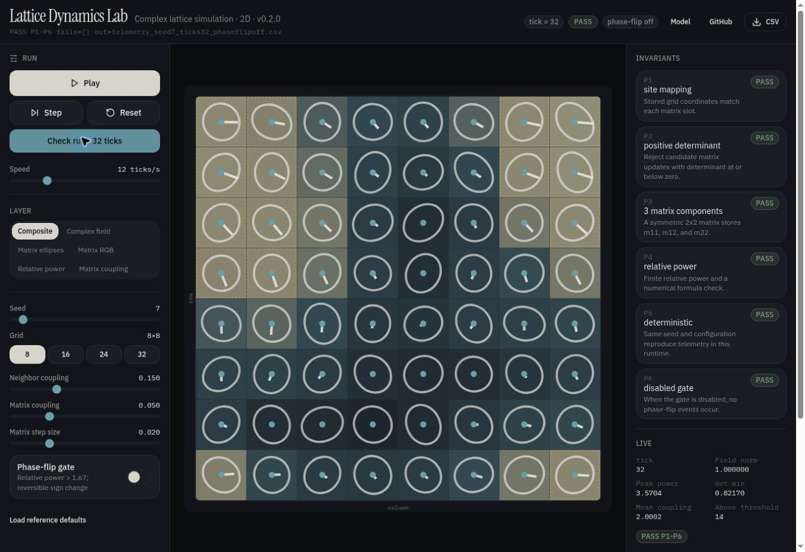

# Lattice Dynamics Lab

**Explore how simple rules create changing patterns, and investigate what makes those patterns change.**

Lattice Dynamics Lab is an interactive simulation that runs in your browser. It gives you a grid of connected cells, a set of adjustable rules, and tools for watching what happens as the system evolves. You can pause, inspect individual cells, repeat a run, and compare the results after changing a setting. *Lattice* means the grid; *dynamics* describes how it changes over time.

## What am I looking at?

Each cell holds a mathematical value that can be pictured as a small arrow. Its length represents magnitude, and its angle represents phase. These arrows describe numerical relationships, not objects moving across the screen.

As the simulation advances, neighboring values influence one another. Each cell also has a small table of numbers, called a matrix, that affects how its value is scaled. These matrices receive repeatable variations, and the entire field is rescaled after each update to maintain a consistent overall numerical magnitude. Together, these rules produce the changing pattern.

The colors, lines, and ellipses provide different views of that calculation. Hover over a cell to inspect its numbers, or switch views to focus on a particular part of the system. The display automatically adjusts its visual scale, so the inspector and exported measurements are the tools for precise comparisons.

## Why is it interesting?

An animation shows you that something changed. The lab gives you a way to investigate **which rule caused the change**.

You can keep the starting setup fixed, repeat the experiment in the same software environment, and then alter one feature. That makes it possible to separate the effect of a rule from the effect of starting with a different arrangement.

For example, the **Phase-flip gate** turns selected arrows halfway around without changing their lengths at that instant. Their magnitudes stay the same, but their relationships with neighboring arrows change. Later updates can therefore produce a different pattern. It is a concrete example of how the relationship between values can matter as much as their individual sizes.

## Try a small experiment

1. Select **Load reference defaults**, then **Check run · 32 ticks**.
2. Inspect the pattern and export the measurements as a CSV file.
3. Enable **Phase-flip gate** and repeat the check, keeping the seed and other settings unchanged.

Compare the pictures and measurements. What changed when you introduced that one rule?

## What does the lab demonstrate?

The lab provides a visible, inspectable environment for learning about numerical simulations and designing controlled experiments. Its checks examine specific software properties, including repeatability and whether certain operations preserve the quantities they should.

Those checks do not establish an advantage in prediction, learning, or other practical tasks. The simulation has also not been calibrated against physical measurements. Its current purpose is to help you explore a system, test its behavior, and build experiments whose results can be examined rather than judged by appearance alone.

[Open the live demo](https://donaldtuttle.github.io/lattice-dynamics-lab-/)



## Run locally

Requires Node.js 22.18 or newer.

```bash
npm ci
npm run dev
```

```bash
npm run check
python -m venv .venv
# Activate the environment, then:
pip install -r requirements-ci.txt
python -m unittest discover -s tests -v
python public/lattice_reference.py --phase-flip on --check-deterministic
```

The browser engine uses sfc32. The Python reference uses NumPy PCG64.
Each replays within its own runtime; equal seeds do not imply equal trajectories
between these two implementations.
Python migration tests also require the pinned original checkout described in
[the validation instructions](docs/VALIDATION.md#repeat). CI fetches it automatically.

## What is verified?

- Coordinate mapping, matrix storage, neighbor stencil, and telemetry schema.
- Deterministic replay and preservation of the original numerical trajectories
  on a pinned migration suite.
- Phase-flip threshold behavior, power preservation, and reversibility.
- Historical CSV compatibility through an explicit adapter.

These are software and numerical regression checks. Performance on an external
prediction, retrieval, or learning task has not been evaluated.
The model has not been calibrated against physical measurements.
See [the model contract](docs/MODEL.md) for exact operations and limitations,
and [the validation record](docs/VALIDATION.md) for executed checks.

## Documentation

- [Visual guide](docs/VISUAL_GUIDE.md): read the canvas and telemetry.
- [Model contract](docs/MODEL.md): state, update order, checks, and experiments.
- [Migration guide](docs/MIGRATION.md): API and schema changes.
- [Origins](ORIGINS.md): pinned source, license, and historical artifacts.

## Hosting

This is a standalone Vite application. `npm run build` writes `dist/`.
The included GitHub Actions workflow checks the application before deploying
`main` through GitHub Pages. Set the repository's **Settings > Pages > Source**
to **GitHub Actions** before the first deployment. Pull requests only run checks.

The Pages asset prefix is derived from the repository name. A production build
records its source commit, repository, application version, and telemetry schema
in `version.json`. The Model panel links to that source commit.

```bash
VITE_BASE_PATH=/lattice-dynamics-lab-/ npm run build
VITE_BASE_PATH=/lattice-dynamics-lab-/ npm run preview
```

See [Actions](https://github.com/donaldtuttle/lattice-dynamics-lab-/actions)
for verification and deployment status. Historical hosted applications remain
separate builds.

## License

MIT. The original copyright notice is preserved in [LICENSE](LICENSE).
